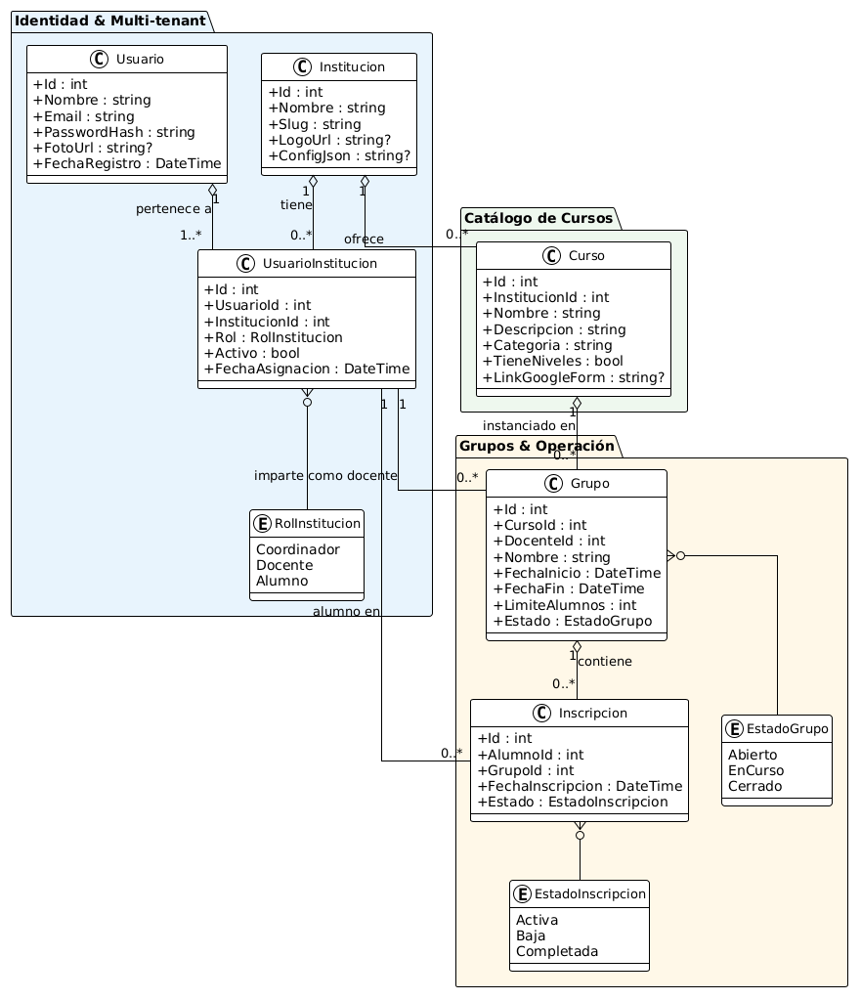

# siav-platform
# (ESPAÑOL) 
SIAV (Sistema Integral Académico Virtual) es una plataforma fullstack open-source diseñada para la gestión eficiente de instituciones educativas en modalidad virtual.
Permite administrar cursos, horarios, inscripciones, tareas y el progreso de los estudiantes dentro de un sistema centralizado.
El sistema implementa una arquitectura basada en capas utilizando tecnologías como C#, ASP.NET Core y SQL Server, integrando autenticación segura mediante JWT y control de acceso por roles (administrador, docente y alumno). Incluye lógica de negocio para la gestión de horarios sin conflictos, seguimiento académico y operaciones optimizadas mediante consultas avanzadas y procedimientos almacenados.
# (ENGLISH)
SIAV (Virtual Academic Integrated System) is an open-source fullstack platform for managing educational institutions in a virtual learning environment.
It enables the management of courses, schedules, enrollments, assignments, and student progress within a centralized system.
The system implements a layered architecture using technologies such as C#, ASP.NET Core, and SQL Server, integrating secure authentication through JWT and role-based access control (administrator, teacher, and student). It includes business logic for conflict-free scheduling, academic tracking, and optimized operations through advanced queries and stored procedures.

## Modelo de Dominio

## 👥 Roles y Permisos

El sistema define tres roles por institución: **Coordinador**, **Docente** y **Alumno**.
Los usuarios no se autoregistran — el Coordinador es quien da de alta a docentes y alumnos.

---

### 🔐 Auth

| Acción | Coordinador | Docente | Alumno |
|--------|:-----------:|:-------:|:------:|
| Registrar usuarios | ✅ | ❌ | ❌ |
| Login | ✅ | ✅ | ✅ |

> El endpoint `POST /api/auth/register` está protegido con `[Authorize(Roles = "Coordinador")]`.  
> Para crear el primer coordinador de una institución nueva, usar el seed de datos o el endpoint de setup.

---

### 📚 Cursos

| Acción | Coordinador | Docente | Alumno |
|--------|:-----------:|:-------:|:------:|
| Crear / editar / eliminar curso | ✅ | ❌ | ❌ |
| Ver catálogo de cursos | ✅ | ✅ | ✅ |

---

### 👥 Grupos

| Acción | Coordinador | Docente | Alumno |
|--------|:-----------:|:-------:|:------:|
| Crear / eliminar grupo | ✅ | ❌ | ❌ |
| Ver todos los grupos de la institución | ✅ | ❌ | ❌ |
| Ver grupos por curso | ✅ | ✅ | ❌ |
| Inscribirse a un grupo | ❌ | ❌ | ✅ |
| Ver mis cursos inscritos | ❌ | ❌ | ✅ |

---

### 🗓️ Horarios _(Semana 2)_

| Acción | Coordinador | Docente | Alumno |
|--------|:-----------:|:-------:|:------:|
| Crear / eliminar horario | ✅ | ❌ | ❌ |
| Ver todos los horarios | ✅ | ❌ | ❌ |
| Ver sus propios horarios | ✅ | ✅ | ❌ |
| Ver horarios de sus cursos inscritos | ❌ | ❌ | ✅ |
| Asignar / reemplazar docente en grupo | ✅ | ❌ | ❌ |

---

### 📝 Tareas y Calificaciones _(Semana 3)_

| Acción | Coordinador | Docente | Alumno |
|--------|:-----------:|:-------:|:------:|
| Crear tareas | ❌ | ✅ | ❌ |
| Ver tareas de un curso | ✅ | ✅ | ✅ |
| Entregar tarea | ❌ | ❌ | ✅ |
| Calificar entrega | ❌ | ✅ | ❌ |
| Ver progreso de alumnos | ✅ | ✅ | ❌ |
| Ver mi propio progreso | ❌ | ❌ | ✅ |

---

### 💳 